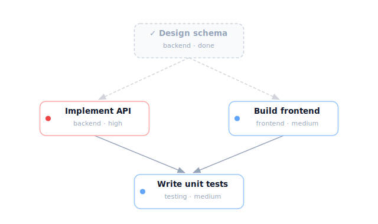

# dagdo

Dependency-aware todo manager. Tasks form a DAG (directed acyclic graph) — topological sort tells you what to do next.



Most todo apps treat tasks as a flat list. Real work has dependencies: you can't deploy before tests pass, can't test before the API is built. **dagdo** models your tasks as a graph and always tells you which tasks are ready to work on right now (zero in-degree nodes).

## Features

- **Dependency graph** — link tasks with `dagdo link`, cycles are automatically rejected
- **What's next?** — `dagdo next` shows tasks with no unfinished blockers (topological sort)
- **Smart completion** — `dagdo done` tells you which tasks just became unblocked
- **Visualize** — ASCII tree, Mermaid syntax, or PNG/SVG image via Graphviz
- **Priority & tags** — filter and sort by what matters
- **Prefix IDs** — type `a3f` instead of the full `a3f1b2`
- **Single binary** — compile to a standalone executable, no runtime needed

## Install

### npm

```bash
npm install -g @coiggahou2002/dagdo
```

### From source (requires [Bun](https://bun.sh))

```bash
git clone https://github.com/Coiggahou2002/dagdo.git
cd dagdo
bun install
bun run build   # produces ./dagdo binary
```

### Pre-built binaries

Download from [GitHub Releases](https://github.com/Coiggahou2002/dagdo/releases).

## Quick start

```bash
# Add tasks
dagdo add "Design database schema" --priority high --tag backend
dagdo add "Implement API" --tag backend
dagdo add "Build frontend" --tag frontend
dagdo add "Integration testing"

# Add dependencies (use ID prefixes)
dagdo link <design-id> --before <api-id>       # Design must finish before API
dagdo link <design-id> --before <frontend-id>  # Design must finish before frontend
dagdo link <api-id> --before <testing-id>      # API must finish before testing
dagdo link <frontend-id> --before <testing-id> # Frontend must finish before testing

# What can I work on right now?
dagdo next
# => Design database schema (it's the only unblocked task)

# Finish a task
dagdo done <design-id>
# => Unblocked: Implement API
# => Unblocked: Build frontend

# See the dependency graph
dagdo graph              # ASCII in terminal
dagdo graph --mermaid    # Mermaid syntax (paste into GitHub/Notion)
dagdo graph --all --png graph.png  # PNG image with done tasks grayed out
```

## Commands

| Command | Description |
|---------|-------------|
| `dagdo add <title>` | Add a task (`--priority`, `--tag`, `--after`, `--before`) |
| `dagdo done <id>` | Mark task as done, shows newly unblocked tasks |
| `dagdo next` | Show tasks ready to do (in-degree = 0) |
| `dagdo list` | List all active tasks with blocker counts |
| `dagdo link <id> --before <other>` | Add dependency edge (with cycle detection) |
| `dagdo unlink <id> <other>` | Remove dependency edge (direction-agnostic) |
| `dagdo graph` | Visualize DAG (`--mermaid`, `--png <file>`, `--all`) |
| `dagdo edit <id>` | Edit task (`--title`, `--priority`, `--tag`, `--untag`) |
| `dagdo rm <id>` | Remove task and its edges |
| `dagdo status` | Overview: total, done, ready, blocked |
| `dagdo help` | Show help |

### ID shortcuts

Every task gets a 6-character hex ID (e.g. `a3f1b2`). You can use any unique prefix:

```bash
dagdo done a3f    # matches a3f1b2
dagdo done a      # works if only one ID starts with "a"
```

## Visualization

```bash
# ASCII tree (default)
dagdo graph

# Mermaid (copy to GitHub issues, Notion, etc.)
dagdo graph --mermaid

# PNG or SVG (requires @hpcc-js/wasm-graphviz and @resvg/resvg-js)
dagdo graph --png output.png
dagdo graph --png output.svg
dagdo graph --all --png full.png   # include done tasks (grayed out)
```

## Data storage

By default, tasks are stored globally in `~/.dagdo/data.json`.

When you run dagdo inside a **git repository**, it checks for a `.dagdo/` directory in the repo root. If found, tasks are stored per-project in `.dagdo/data.json`. If not, dagdo prompts you to choose between project-level and global storage on first use.

This means teams can commit `.dagdo/data.json` to share task graphs, or add `.dagdo/` to `.gitignore` for personal use.

## License

MIT
